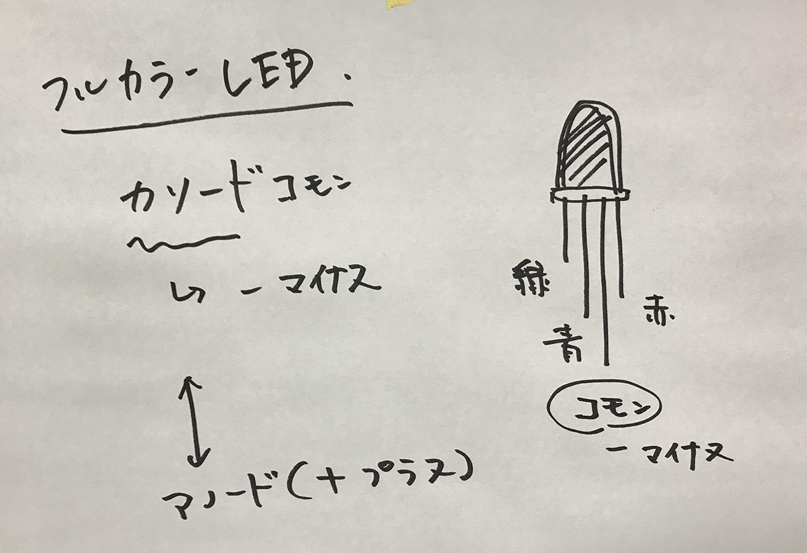

# Study-Arduino  


### index  

- LED-Debug-02 // Lチカ

- LED-Debug-13 // 13版はオンボードのLED, Lチカ  

- LED-x3 // Lチカ x3  

- LED-analogWrite // PWM(Plus Width Modulation：パルス幅変調)出力を使って、光る強さの制御  


- Test-pySerial // Python ←→ Arduino でのシリアル通信  
  - Test-Send  
    - Test-Send.ino  
  - Send-01.py // Sender + Reader  

- [pySerial.md](https://github.com/naysok/Study-Arduino/blob/master/pySerial.md) // pySerial memo  


---  

---  

### Arduino のデバッグ  

LED-Debug-13.ino  

13 番ピンは、ボードに乗ったデバッグ用の LED  
いわゆるLチカです。  

Serial.println() でシリアルモニタに値を返す  
これには、setup() 内で、 Serial.begin(9600); と書いておく必要がある  

``` c
#define LED_PIN 13
// int LED_PIN 13; // これでも同じ

int i = 0;
String msg;

void setup() {
  Serial.begin(9600); // これを書いておくと、シリアルモニタに値が返る  
  pinMode(LED_PIN, OUTPUT);

}

void loop() {

  msg = "i : " + String(i);
  Serial.println(msg);

  digitalWrite(LED_PIN, HIGH);
  Serial.println("high");
  delay(200);

  digitalWrite(LED_PIN, LOW);
  Serial.println("low");
  delay(1000);

  i++;

}

/*
out

i : 0
high
low
i : 1
high
low
i : 2
high
low
i : 3
high
low
i : 4
high
low
.
.
.
*/
```

##### Ref.  

Serial.println(); が見えない  
[http://canon4444.hatenablog.com/entry/2015/04/29/181308](http://canon4444.hatenablog.com/entry/2015/04/29/181308)  


---  


### analogWrite()   

LED-analogWrite.ino  

digitalWrite() は、HIGH or LOW （ON or OFF）の二択  
analogWrite() は、0 ~ 255 までの値を取れる

仕組みは、PWM（Plus Width Modulation：パルス幅変調）

LED はこれで、光る強さを制御できた。  


##### Ref.  

PWMを使ってLEDの明るさと出力を制御する ～ Arduino LV5 ～  
[http://www.japanese-makers.com/archives/157](http://www.japanese-makers.com/archives/157)  


----  


### 手元にあるフルカラー LED のメモ  

カソードコモンというタイプ  

  
